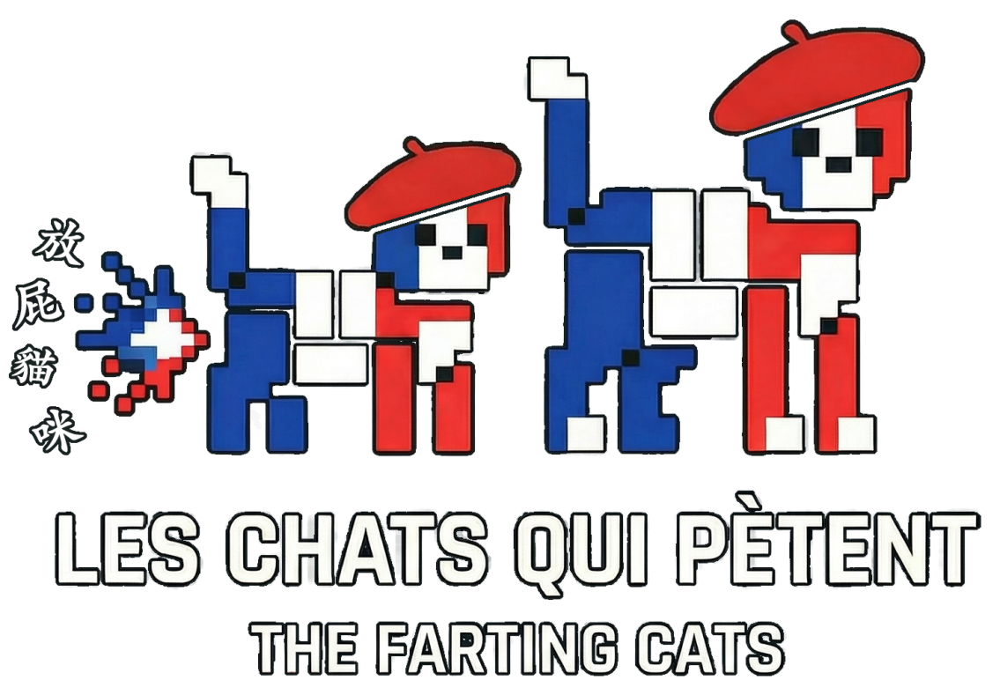

# 🐱 Les Chats Qui Pètent

  
  
<i>A high-stakes, real-time Taboo-style game where humans and AI collide.</i>

   
  <a href="https://aiheardthat.live"><strong>🌐 LIVE DEMO: aiheardthat.live</strong></a>

---

## 🇸🇬 Mistral Worldwide Hackathon - Singapore

This project was developed for the **[Mistral Worldwide Hackathon](https://worldwide-hackathon.mistral.ai/)** in **Singapore**.

**Team: Les Chats Qui Pètent**
*   4 members based in Singapore.
*   Built with ❤️ and Mistral AI.

---

## 🎮 Project Overview

**Les Chats Qui Pètent** is a real-time, multiplayer Taboo-style game. One player acts as the **Game Master (GM)**, describing a secret target word without using forbidden "taboo" words. 

**The twist?** Both human players and a **Mistral-powered AI Guesser** are listening to the live transcript and racing to be the first to guess the word.

### 🎯 Project Aim
The goal of this project is to showcase what **real-time AI** can deliver—low-latency, interactive experiences that feel truly alive. Additionally, it demonstrates how a **fun, engaging game** can help collect valuable **training data** for future AI improvements, bridging the gap between entertainment and data science.

### 🚀 Technical Highlights
*   **Hybrid Edge-Cloud Architecture**: We utilize a hybrid approach for real-time inference, leveraging local edge processing on **ASUS Ascent GX10** hardware alongside **Mistral Small** in the cloud.
*   **Real-Time Hybrid Flow**: A sophisticated "Half-Cloud / Half-Local Edge" setup where critical processing happens at the edge for responsiveness, coupled with the power of cloud-based Mistral models.
*   **vLLM Inference**: Powered by **vLLM** for high-throughput, low-latency inference, ensuring the AI guesser stays ahead of the game.
*   **Fine-Tuned Mistral Small**: We locally fine-tuned a **Mistral Small** model to specifically improve its "guessing power" and semantic understanding in competitive gaming contexts.
*   **Live Voice Streaming**: The GM's speech is transcribed in real-time for immediate processing.
*   **AI vs. Humans**: A high-stakes environment where the AI learns and competes in real-time.
*   **Real-time Synchronization**: Powered by WebSockets for a seamless, lag-free experience.

---

## 📖 Documentation

Explore the technical details and game mechanics:

*   **[Game Flow & Rules](gameflow.md)**: A comprehensive guide to roles, rules, and the WebSocket state machine.
*   **[Backend Architecture](backend/game-logic.md)**: Deep dive into concurrency, locking, and the AI guesser loop.
*   **[Frontend Setup](frontend/README.md)**: Information on the React + Vite + TypeScript frontend.

---

## 🔗 Quick Links
- **Live Demo**: [aiheardthat.live](https://aiheardthat.live)
- **Official Hackathon Site**: [worldwide-hackathon.mistral.ai](https://worldwide-hackathon.mistral.ai/)
- **Singapore Event Details**: [luma.com/mistralhack-singapore](https://luma.com/mistralhack-singapore)

---

## 📄 License

This project is licensed under the [MIT License](LICENSE).

